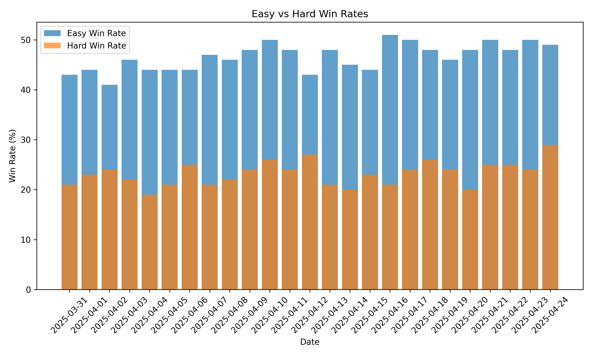
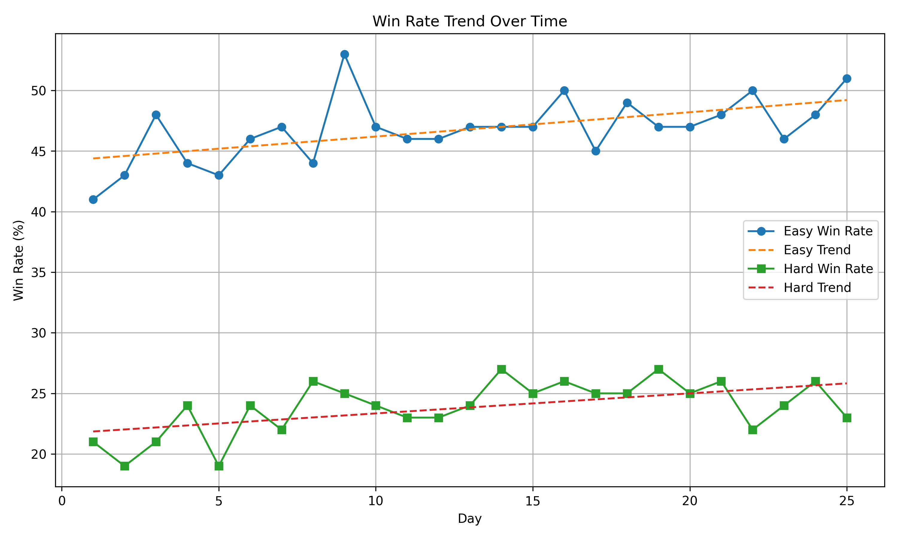
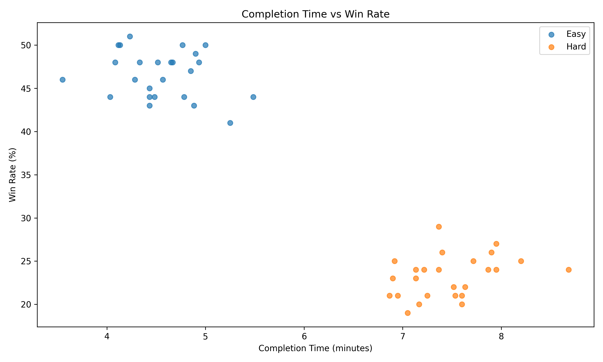

# Sudoku Performance Analysis
This project analyzes the performance of Sudoku games played by the user, focusing on completion time, win rates, and the difficulty levels. The goal is to understand how the player's win rate varies across different difficulty levels and over time, as well as the relationship between the time spent completing the puzzle and the win rate.

## Project Objective
The objective of this project is to:
- Analyze the win rates and completion times for easy and hard Sudoku puzzles.
- Investigate whether there is a correlation between time spent on a puzzle and the success rate.
- Examine how win rates change over time.

## Data Source  
- The data will be manually recorded from a Sudoku mobile application. Each day, data will be collected separately for **Easy and Hard** difficulty levels. The key metrics that will be tracked are:  
  - Number of games played per day (Easy & Hard)  
  - Win rate (%) (Easy & Hard)  
  - Number of error-free (perfect) wins (Easy & Hard)  
  - Fastest completion time (Easy & Hard)  
  - Average completion time (Easy & Hard)  
  - Winning streaks (Easy & Hard)  

## Data Collection Plan  
Data will be recorded daily in a **CSV file**. Below is the sample data:  

| Date       | Easy Games | Easy Win Rate | Easy Perfect Wins | Easy Fastest Time | Easy Average Time | Easy Winning Streak | Hard Games | Hard Win Rate | Hard Perfect Wins | Hard Fastest Time | Hard Average Time | Hard Winning Streak |
|------------|------------|---------------|--------------------|-------------------|-------------------|---------------------|------------|---------------|--------------------|-------------------|-------------------|---------------------|
| 2025-03-10 | 4          | 90%           | 3                  | 3.2               | 4.5               | 5                   | 2          | 70%           | 1                  | 5.8               | 7.3               | 2                   |
| 2025-03-11 | 5          | 85%           | 2                  | 3.0               | 4.8               | 4                   | 3          | 65%           | 1                  | 6.2               | 8.0               | 1                   |

## Data Cleaning and Organization
-**Mean Imputation**: For missing data that was sparse and not expected to have a significant impact on overall data, I filled in the missing values with the average of the respective column. The mean imputation were carefully selected to avoid introducing bias into the dataset. By using mean imputation, the central tendency of data is preserved.
-**Handling Duplicates**: Duplicate rows were removed to prevent over-representation of certain entries and maintain the integrity of the data.

## Hypothesis 1 - Easy vs Hard Win Rate Comparison

To test whether there is a statistically significant difference in win rates between easy and hard Sudoku puzzles, an independent t-test was conducted.

- **H₀:** The mean win rates for easy and hard puzzles are equal.
- **H₁:** The mean win rates for easy and hard puzzles are different.

### Method:
An independent **t-test** was performed to compare the win rates of easy and hard puzzles. The t-statistic and p-value were calculated to test whether the difference in win rates was statistically significant.

### Result:
- **t-statistic**: 31.959
- **p-value**: 0.0
- **Conclusion**: Since the p-value is much smaller than the significance level of 0.05, we reject the null hypothesis. Therefore, we conclude that there is a statistically significant difference between the win rates of easy and hard puzzles.

### Visualization:

**Bar Chart Comparing Easy vs Hard Win Rates:**

## Hypothesis 2 - Trend Analysis of Win Rates Over Time

This hypothesis tests if the win rate improves over time for both easy and hard puzzles. A linear regression model was used to examine the trend in win rates over time.

- **H₀:** There is no trend in win rate over time.
- **H₁:** There is a positive trend in win rate over time.

### Method:
Linear regression was performed to test if there is a significant trend in win rates over time for both easy and hard levels. The **slope** and **p-value** were used to determine the strength and significance of the trend.

### Result:
- **Easy Level**:
    - **Slope**: 0.252
    - **p-value**: 0.00019
    - **Conclusion (Easy)**: There is a statistically significant increasing trend in win rate over time.
  
- **Hard Level**:
    - **Slope**: 0.132
    - **p-value**: 0.04785
    - **Conclusion (Hard)**: There is a statistically significant increasing trend in win rate over time.

### Visualization:

**Win Rate Trend Over Time:**

## Hypothesis 3 - Correlation Between Completion Time and Win Rate

### Hypothesis:
- **H₀:** There is no correlation between completion time and win rate.
- **H₁:** There is a significant correlation between completion time and win rate.

### Method:
Pearson correlation was calculated to analyze the relationship between completion time and win rate for both easy and hard puzzles. The **correlation coefficient** and **p-value** were used to assess the strength and significance of the relationship.

### Result:
- **Easy Level**:
    - **Correlation**: -0.225
    - **p-value**: 0.28006
    - **Conclusion (Easy)**: No significant relationship detected.
  
- **Hard Level**:
    - **Correlation**: 0.338
    - **p-value**: 0.09795
    - **Conclusion (Hard)**: No significant relationship detected.

### Visualization:

**Completion Time vs Win Rate Correlation:**

## Results and Discussion

- **Hypothesis 1**: The t-test confirmed that there is a statistically significant difference between the win rates of easy and hard puzzles, with the easy puzzles having a higher win rate.
  
- **Hypothesis 2**: Both easy and hard puzzles showed a statistically significant increasing trend in win rates over time, suggesting that performance improves over time.

- **Hypothesis 3**: No significant correlation was found between completion time and win rate for both easy and hard levels. The weak negative correlation for easy puzzles and the moderate positive correlation for hard puzzles were not statistically significant.

These findings provide insight into the player's performance over time and across difficulty levels, and suggest that the time spent solving puzzles does not significantly influence the win rate.

